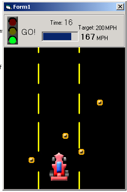



## \[\_A Very Simple Car Game \_\!

### Description

Teaches basics of collision detection(PictureBoxes), game programming, controlling objects by mouse, ProgressBar, and Image indexes. Also writes and reads from .ini files.

Before clicking the back button, Please VOTE FOR ME!!!(My code teaches a lot of stuff)
 
### More Info
 
The code may have a few bugs.

             |
---                |---
**Submitted On**   |2002-04-28 18:48:52
**By**             |[Tomas Tupy](https://github.com/Planet-Source-Code/PSCIndex/blob/master/ByAuthor/tomas-tupy.md)
**Level**          |Intermediate
**User Rating**    |4.2 (293 globes from 70 users)
**Compatibility**  |VB 4\.0 \(32\-bit\), VB 5\.0, VB 6\.0
**Category**       |[Games](https://github.com/Planet-Source-Code/PSCIndex/blob/master/ByCategory/games__1-38.md)
**World**          |[Visual Basic](https://github.com/Planet-Source-Code/PSCIndex/blob/master/ByWorld/visual-basic.md)
**Archive File**   |[Very\_Simpl768854282002\.zip](https://github.com/Planet-Source-Code/tomas-tupy-a-very-simple-car-game__1-34204/archive/master.zip)

